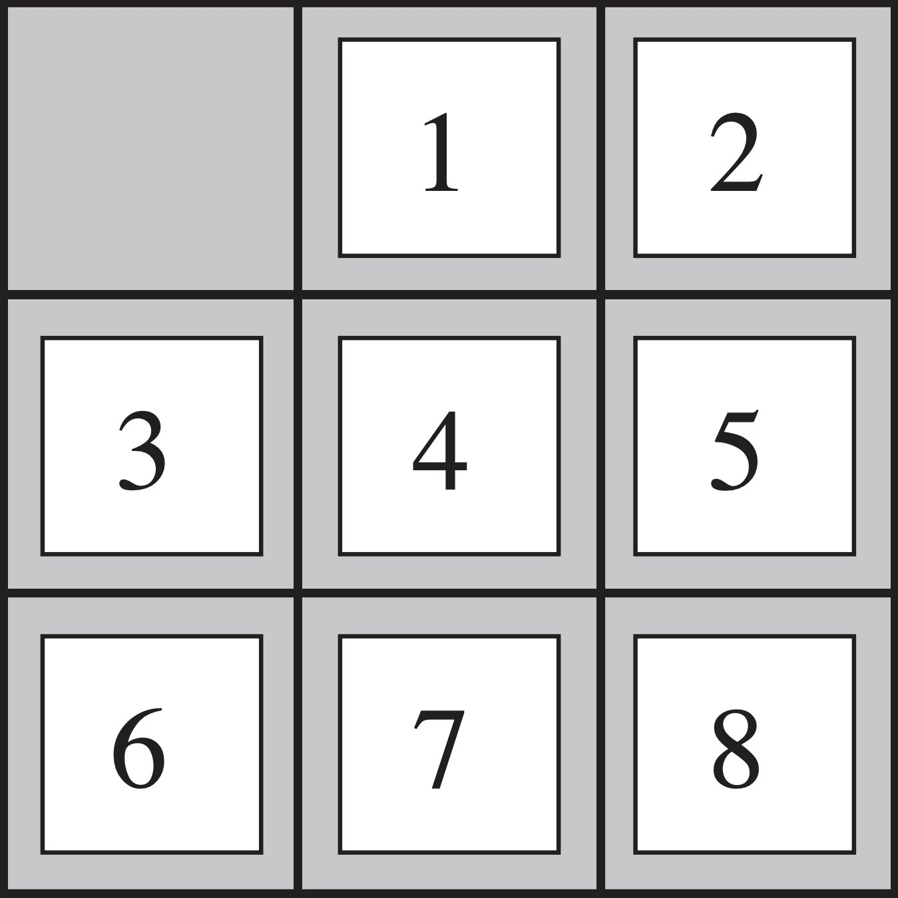

# 8 Block Puzzle 

## About

We can move the blank space by typing the number you want to switch it with , but there are some rule:
1. The number should be directly adjacent to the blank space.
2. The number can only move vertically and horizontally and not diagonally.

## Goal

The goal of this game is to make the pattern look like the image below.

